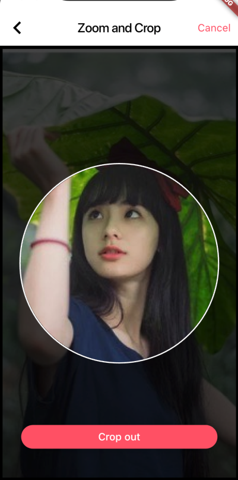
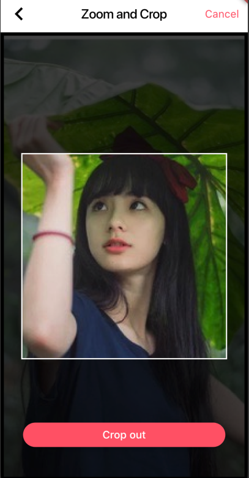

# Image Zoom and Cropping plugin for Flutter

A simple and easy used flutter plugin to crop image on iOS and Android.





## Installation

Add `simple_image_crop` [](https://pub.dartlang.org/packages/simple_image_crop) as [a dependency in `pubspec.yaml`](https://flutter.io/using-packages/#managing-package-dependencies--versions).

## Using

### Create a widget to load and edit an image:

> image can be of any type:

```dart
  ImgCrop(...),  //  ImageProvider
  ImgCrop.file(...) // Image file
  ImgCrop.asset(...) // Image assets your local
```

```dart
final imgCropKey = GlobalKey<ImgCropState>();

Widget _buildCropImage() {
  return Container(
      color: Colors.black,
      child: ImgCrop(
        key: cropKey,
        chipRadius: 150,  // crop area radius
        chipShape: 'circle', // crop type "circle" or "rect"
        image: Image.file(imageFile), // you selected image file
      ),
  );
}
```

### Generate a cropped image:

> a `async` function get cropped file image:

-   `croppedImage` is you cropped image `File`
-   `pictureQuality` Can control image size and quality

```dart
  final croppedFile = await crop.cropCompleted(
    croppedImage,
    {pictureQuality: 900}
  )
```

```dart
floatingActionButton: FloatingActionButton(
  onPressed: () async {
    final crop = cropKey.currentState;
    final croppedFile =
        await crop.cropCompleted(args['image'], pictureQuality: 900);

    // show you croppedFile ……
    showImage(context, croppedFile);
  },
```

it's so esay !
